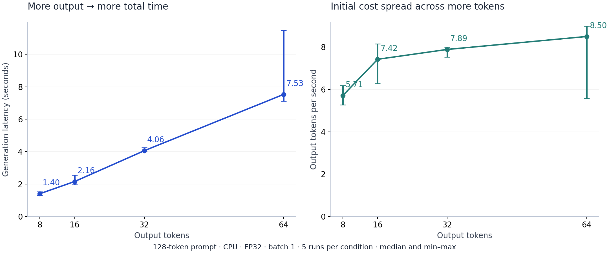
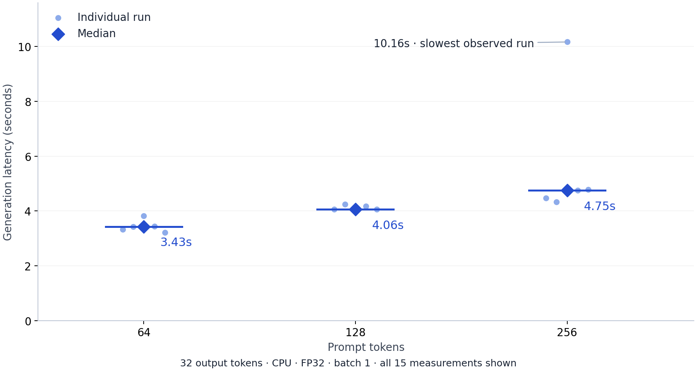

# Serving and benchmarking a small language model

I’m starting this series by making a language model run, then measuring its behavior. My background is mechanical engineering and solutions engineering / developer relations. Inference gives me a familiar kind of problem: understand the system, control the inputs, and measure the response.

For this first lesson, the system is a small language model on a two-core VM. The build is a minimal HTTP server and a repeatable benchmark. The experiments vary **output sequence length** and **input sequence length** independently. Together, they give us a starting intuition for prefill, decode, and generation latency.

## 01 / The setup

The model is **SmolLM2-135M**, a base language model with about 135 million learned parameters. Those parameters, or *weights*, are the numbers used to predict the next token. A token is a piece of text: sometimes a word, sometimes part of a word, sometimes punctuation.

The VM provides two CPU cores and 3.82 GiB of RAM. Running this model at FP32—four bytes per parameter—uses about **513 MiB for its weights**. Peak process memory during the experiment was **1.06 GiB**, covering the weights and the program’s other allocations. This leaves enough room to run the lesson comfortably.

<div class="setup-grid"><div><span>MODEL</span><strong>SmolLM2-135M</strong></div><div><span>COMPUTE</span><strong>2 CPU cores</strong></div><div><span>PRECISION</span><strong>FP32</strong></div><div><span>WORKLOAD</span><strong>1 request at a time</strong></div></div>

I used PyTorch 2.6.0, Transformers 4.48.3, two CPU threads, eager attention, and greedy generation. *Greedy* means choosing the highest-scoring allowed next token at each step. The model revision and full environment are saved alongside the measurements.

## 02 / A minimal inference server

An inference server is a program that loads a model and waits for requests. Our server loads the weights once. For each request, it converts the prompt into token IDs, generates a continuation, and returns the result as JSON.

<figure class="diagram"><div class="request-flow"><div><b>01</b><strong>Request</strong><span>Text + output length</span></div><span class="flow-arrow" aria-hidden="true">→</span><div><b>02</b><strong>Tokenizer</strong><span>Text → token IDs</span></div><span class="flow-arrow" aria-hidden="true">→</span><div><b>03</b><strong>Model</strong><span>Predict next tokens</span></div><span class="flow-arrow" aria-hidden="true">→</span><div><b>04</b><strong>Response</strong><span>IDs → readable text</span></div></div><figcaption>The model stays loaded between requests. The tokenizer converts between text and the numerical IDs the model consumes.</figcaption></figure>

Download and unzip the lesson bundle, then open its `lesson-01` folder in a terminal. On a fresh machine, install the dependencies and fetch the pinned model using the commands in its README. On this VM, the environment is already installed in `/root/inference-engineering/lessons/01-baseline`.

Start the server:

```bash
.venv/bin/python lab.py serve
```

In a second terminal, send a request:

```bash
curl http://127.0.0.1:8001/generate \
  -H 'Content-Type: application/json' \
  -d '{"prompt":"Gravity is","max_new_tokens":16}'
```

The recorded response continued the prompt with:

<blockquote class="completion">the force that holds the Earth and the Moon together.<br><br>The Moon is</blockquote>

That response contained 16 generated tokens and took 1.86 seconds inside the generation call. This is a useful first milestone: text went into a running model, and a real completion came back.

The core call uses these settings:

```python
with torch.inference_mode():
    output = model.generate(
        input_ids=tokens,
        attention_mask=torch.ones_like(tokens),
        min_new_tokens=count,
        max_new_tokens=count,
        do_sample=False,
        use_cache=True,
        pad_token_id=model.config.eos_token_id,
    )
```

`inference_mode()` avoids tracking gradients needed for training. `use_cache=True` lets generation reuse processed information from earlier tokens. Setting both output-length limits to the same count makes each experiment produce a fixed number of tokens. That explains the abrupt ending in the sample: it stopped at our requested length.

## 03 / Prefill and decode

Generation has two phases. **Prefill** processes the prompt and produces scores used to select the first output token. **Decode** then generates subsequent tokens one at a time, using the context accumulated so far.

<figure class="diagram phase-diagram"><div class="phase-row"><div class="phase-name"><b>Prefill</b><span>Process the prompt</span></div><div class="phase-tokens"><span class="input-token">Gravity</span><span class="input-token">is</span><span aria-hidden="true">→</span><span class="new-token">the</span></div></div><div class="phase-row"><div class="phase-name"><b>Decode</b><span>Extend the answer</span></div><div class="phase-tokens"><span class="past-token">the</span><span aria-hidden="true">→</span><span class="new-token">force</span><span aria-hidden="true">→</span><span class="new-token">that</span><span aria-hidden="true">→ …</span></div></div><div class="cache-rail">Processed context is retained and grows as generation continues.</div><figcaption>Schematic, with word groups for readability. Prefill selects the first output token; each following token requires another decode step. Diagram spacing represents order.</figcaption></figure>

The reusable information lives in the **key/value cache**, usually shortened to *KV cache*. For now, the important idea is that generation saves work from earlier tokens and consults it during later steps. We’ll implement and inspect that mechanism in a later lesson.

A longer answer requires more sequential decode steps. A longer prompt changes the work done during prefill and the context used during decode. That distinction motivates the two benchmarks.

<details class="checkpoint"><summary><span>CHECK YOUR INTUITION</span>If output length doubles, should total generation time double?</summary><p>Prompt processing is a one-time cost for the request. With the same prompt, doubling the output increases the number of decode steps while keeping that initial work roughly fixed. Total time can therefore grow by less than two times. The cost of individual steps can also vary as context grows.</p></details>

## 04 / Designing the benchmark

I measured **generation latency**: the wall-clock duration of the complete `.generate()` call. I also calculated **output throughput** as generated tokens divided by that duration. This throughput includes prompt processing and generation overhead.

The benchmark calls the model directly with token IDs prepared in advance. That keeps the measurement focused on generation. Loading, text conversion, and HTTP handling are measured outside this timer.

```python
start = time.perf_counter()
output = generate(torch, model, prompt_tokens, count)
elapsed = time.perf_counter() - start
output_tokens_per_second = count / elapsed
```

Every condition gets two warmup runs followed by five measured runs. The order is shuffled with a fixed seed to spread conditions across the session. Prompts are exact-length prefixes of one repeated passage; their token IDs are included in the results. Each condition produced identical token sequences across its repetitions.

There are six distinct conditions and 30 measured runs. The 128-input / 32-output condition belongs to both sweeps. In the charts, a median gives the middle observation; the individual runs or whiskers show the spread.

## 05 / Experiment 1: output-length scaling

First, I fixed the prompt at **128 tokens** and requested **8, 16, 32, and 64 output tokens**. This isolates the effect of extending the generated sequence while keeping the starting context consistent.

<figure class="chart"><picture><source media="(max-width: 600px)" srcset="lesson-01-assets/output-scaling-mobile.png"></picture><figcaption><b>FIG. 03.</b> Latency and throughput from the same output-length sweep. Points show medians of five runs; whiskers show the full observed range. The two panels use separate labeled scales.</figcaption></figure>

Median latency increased from **1.40 seconds to 7.53 seconds**. That is about **5.37× the time for 8× the output**. Over the same range, median throughput increased from **5.71 to 8.50 output tokens per second**.

The throughput increase is consistent with spreading the initial prompt-processing cost across a longer answer. A higher overall tokens/s value can occur even when the underlying per-token generation speed stays similar. This makes output length part of the definition of a useful benchmark: an 8-token response and a 64-token response measure different workloads.

The longest-output condition also varied noticeably, taking between **7.11 and 11.48 seconds**. Keeping the full range visible gives the median its necessary context.

## 06 / Experiment 2: input-length scaling

Next, I fixed output at **32 tokens** and increased the prompt from **64 to 128 to 256 tokens**.

My initial intuition was that processing prompt tokens in parallel might keep the time roughly constant. Parallel execution helps use the hardware efficiently, but the processor still has finite capacity and more input means more computation.

<details class="checkpoint"><summary><span>PAUSE BEFORE THE RESULTS</span>What would you expect from a fourfold increase in prompt length?</summary><p>Consider two effects: more input to process during prefill, and a longer context to consult during generation. The size of the timing change depends on the hardware and workload. The useful prediction is a direction and a reason; the experiment supplies the magnitude.</p></details>

<figure class="chart"><picture><source media="(max-width: 600px)" srcset="lesson-01-assets/input-scaling-mobile.png"></picture><figcaption><b>FIG. 04.</b> Each small point is one measured run. Diamonds mark medians. All requests generated 32 tokens. The slow 256-token observation is retained in the chart and raw data.</figcaption></figure>

Median latency rose from **3.43 seconds to 4.75 seconds**: approximately **1.38× the time for 4× the input**. The 128-token prompt sat between them at **4.06 seconds**.

This establishes the total-latency effect for our workload. Assigning that increase to prefill and decode requires separate timers. Both phases are inside the current measurement, and each new decode token attends to the context already present.

The five 256-token runs ranged from **4.33 to 10.16 seconds**. Shared-machine contention is a possible explanation for slower runs; identifying a cause would require more instrumentation. For this baseline, I preserved every observation and reported the median alongside the spread.

## 07 / Reproduce and extend

The downloadable bundle contains the server, client, benchmark, plotting scripts, pinned model revision, and original results. Stop the server before benchmarking so the experiment has the CPU and memory available to itself.

```bash
.venv/bin/python client.py      # While the server is running
# Stop the server with Ctrl-C, then:
.venv/bin/python lab.py benchmark
.venv/bin/python plot.py
```

The benchmark writes to `results/`. Save a copy of the supplied results before rerunning so you can compare your measurements with the published baseline. The client checks server health, requests a real completion, and verifies that an oversized request is rejected.

A useful extension is adding a **512-token prompt** with output fixed at 32 tokens. Write down a prediction first. Then keep the model, precision, thread count, output length, and measurement procedure fixed while changing that one input length.

<details class="checkpoint"><summary><span>READ THE TIMER</span>Would a request waiting in the server’s queue appear in these benchmark numbers?</summary><p>This benchmark starts its timer immediately before the direct generation call. A user-facing measurement would start when the client sends a request, including network handling and queueing. Choosing the timer boundaries defines the question the measurement answers.</p></details>

## 08 / What I’m taking into lesson 2

The first result is a working system with a reproducible baseline. Output-length scaling showed how a longer generation can spread the prompt-processing cost across more tokens. Input-length scaling showed a measurable rise in total latency, with enough variation to make repeated runs valuable.

The next implementation is a **manual prefill and decode loop**. I’ll compare its generated tokens with the library output, then instrument the phases independently. That turns the combined latency curve into a more useful explanation of how the model spends its time.

## Reading alongside the build

- [SmolLM2-135M model card](https://huggingface.co/HuggingFaceTB/SmolLM2-135M): the model and loading example used in the server.
- [Scaling book: transformer inference](https://jax-ml.github.io/scaling-book/inference/): the prefill, generation, and cache explanation behind the experiments.
- [Transformers 4.48.3 generation](https://huggingface.co/docs/transformers/v4.48.3/en/main_classes/text_generation): the generation settings used in the benchmark.
